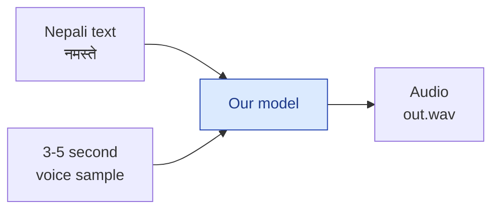
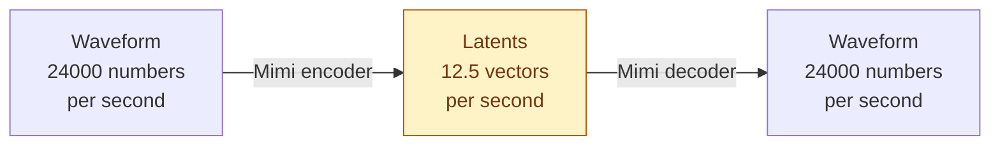
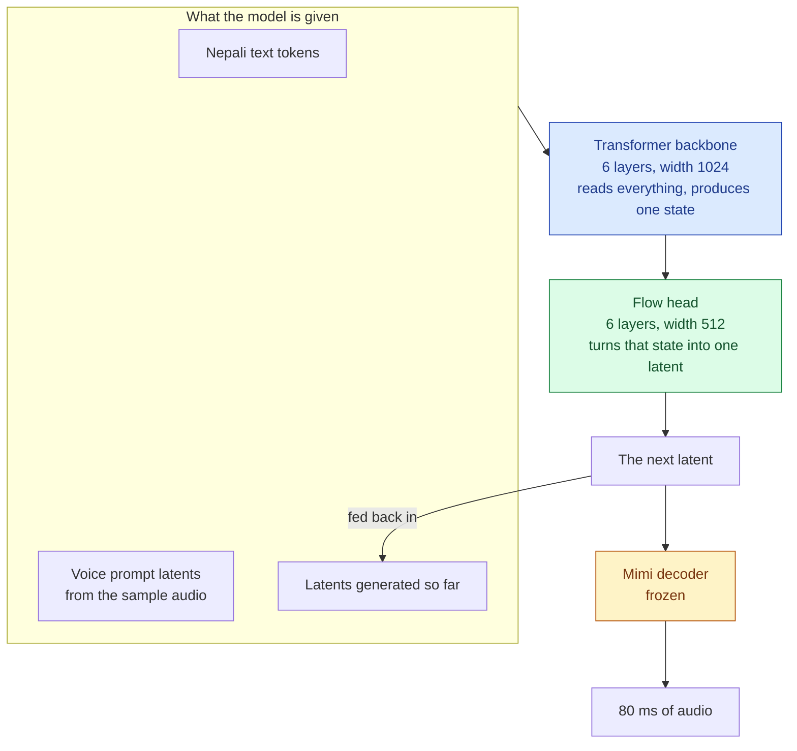
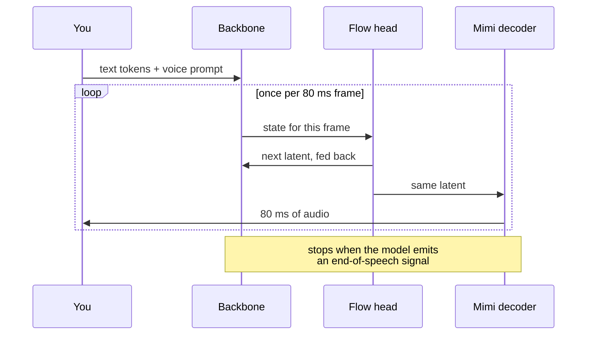
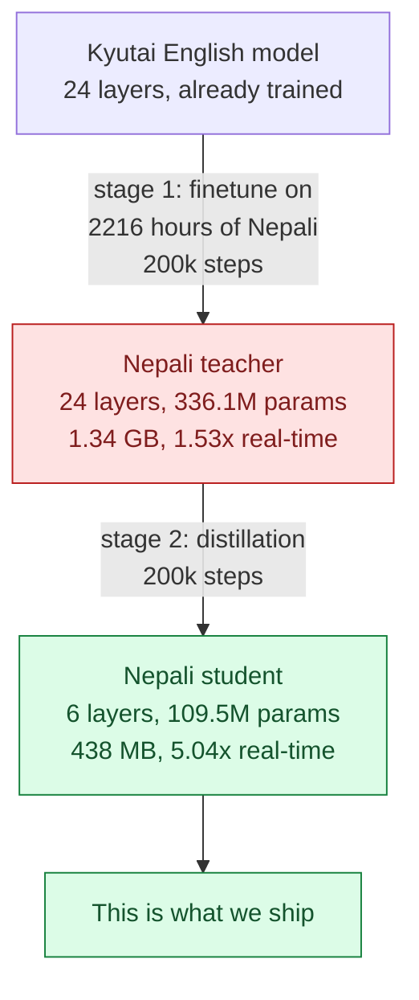
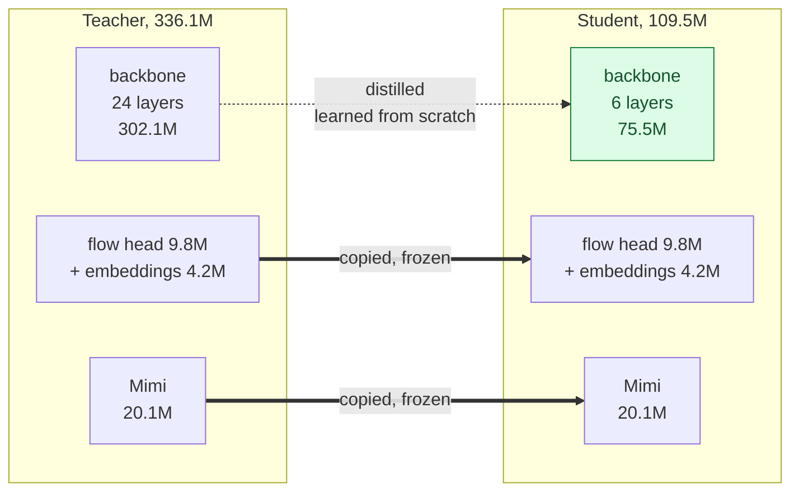
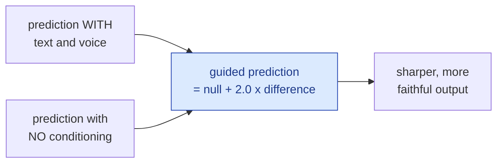
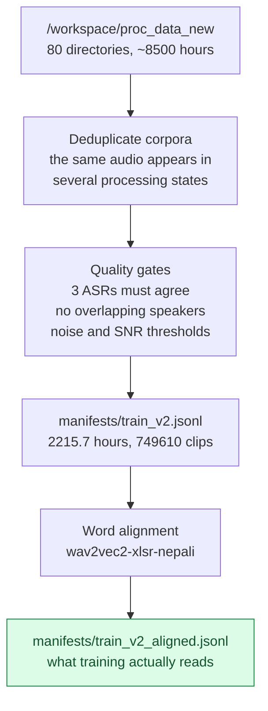
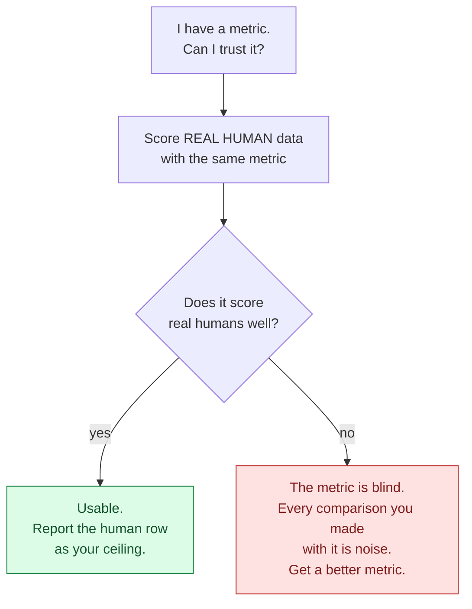

# Nepali Pocket-TTS — a study guide for taking over training

Welcome. You are taking over training and finetuning for this Nepali
text-to-speech model. This guide assumes you know a little Python and have heard
the words "encoder" and "decoder" but do not yet feel at home with them. Nothing
here assumes you have trained a speech model before.

Read it in order. It builds up. There are exercises at the end, and they are the
part that actually teaches you — the reading only makes the exercises make sense.

**How to use this with the other documents:**

| Document | What it is for |
|---|---|
| This guide | Learning how the thing works |
| [`ADR.md`](./ADR.md) | *Why* each decision was made — read after Part 5 |
| [`../CLAUDE.md`](../CLAUDE.md) | The commands, the file layout, the traps |

---

## Part 1 — The thirty-second picture

Our job: turn **Nepali text** into **speech that sounds like a particular person**.



Two inputs, one output. The text says *what* to say. The voice sample says *who*
should say it — this is called **voice cloning**, and our model can do it from a
few seconds of audio without any retraining.

That is the whole product. Everything below is about what is inside the blue box.

---

## Part 2 — The words you need

Learn these seven. Everything else in this project is built from them.

**Token.** Computers cannot read text directly, so we chop text into small pieces
called tokens and give each piece a number. "नमस्ते" might become 2 or 3 tokens.
Our tokenizer has 4,000 possible tokens, all Nepali.

**Embedding.** A token number like `1873` means nothing on its own. An embedding is
a lookup table that turns each token number into a list of, say, 1024 numbers — a
*vector*. Similar tokens end up with similar vectors. Think of it as giving each
token a location on a map, where related things sit near each other.

**Encoder.** A part of a model that *reads* something and produces a summary of it.
It sees the whole input at once. Reading comprehension.

**Decoder.** A part of a model that *produces* something, usually one piece at a
time, where each new piece can look at what it already produced. Writing.

> A useful mental image: an **encoder** is a person reading a whole page and
> understanding it. A **decoder** is a person writing a sentence word by word, able
> to look back at what they have written so far but not forward at what they have
> not written yet.

**Autoregressive.** A fancy word for "one step at a time, feeding your own output
back in as the next input". Our model generates audio autoregressively: it makes a
tiny slice of sound, looks at that slice, makes the next one, and so on.

**Transformer layer.** The standard building block of modern models. Each layer
lets every position in the sequence look at every other position — that mechanism
is called **attention** — and then does a bit of per-position arithmetic. Stack
more layers and the model can represent more complicated patterns. Our two models
differ almost entirely in *how many* of these layers they have: 24 versus 6.

**Latent.** A compressed numerical representation of something. Instead of working
with raw audio — 24,000 numbers per second, which is enormous — we work with
*latents*: 12.5 compact vectors per second that a separate model knows how to turn
back into sound.

---

## Part 3 — How audio becomes numbers: the Mimi codec

Raw audio is a huge list of numbers. One second of our audio is 24,000 numbers. A
five-second clip is 120,000. No model wants to predict that directly, one number at
a time.

So we use a **codec** — a model that squeezes audio into something small and can
unsqueeze it back. Ours is called **Mimi**, and it comes from Kyutai. We did not
train it; we use it exactly as shipped.



Notice this is an encoder and a decoder working as a pair. The encoder squeezes,
the decoder unsqueezes. The squeezed thing in the middle is a latent.

**The number to remember: 12.5 latents per second.** That means each latent covers
80 milliseconds of sound. We call one latent a **frame**. When you later read "80
ms per frame is the real-time budget", this is why: if the model takes longer than
80 ms to produce one frame, it cannot keep up with playback.

Mimi has 20.1 million parameters and is **frozen** in all our training. It is a
fixed tool, like a screwdriver. We never adjust it.

---

## Part 4 — What our model actually does

Our model's only job is: **predict the next latent.** Mimi turns those latents into
sound afterwards.



Two parts belong to us:

- The **backbone** is the decoder in the sense of Part 2: it produces output one
  frame at a time and looks back at what it already produced. It is where almost
  all the parameters live and almost all the time is spent.
- The **flow head** is small and turns one backbone state into one actual latent.
  "Flow" refers to flow matching, a technique for generating a value by starting
  from noise and taking a step toward the real thing. Ours takes a single step.

Now the loop, in time order:



The two right-hand columns run **in parallel threads**: while Mimi decodes frame
*n*, the backbone is already working on frame *n+1*. That matters for speed — the
total time is roughly the slower of the two stages, not their sum.

Measured on 4 CPU threads, for our shipped model: backbone + flow head take
**12.7 ms** per frame, Mimi takes **8.1 ms**. Both comfortably under the 80 ms
budget, which is why we run about 5x faster than real time.

---

## Part 5 — Why there are two models

Open `runs/` and `/workspace/` and you will find a **teacher** with 24 layers and a
**student** with 6. Here is why.

A 24-layer model has more capacity, so it learns a brand-new language better. But
measured on a CPU it produces speech at only 1.53x real time, and early on it
measured *slower* than real time. Too slow and too big to ship.

So we do this:



**Distillation** means: a big trained model teaches a small untrained one. In our
case the student is not shown the right *answers* from the dataset. It is shown the
teacher's **internal activations** — the numbers coming out of the teacher's
backbone — and trained to produce the same numbers with a quarter of the layers.
The loss is a plain mean-squared error between the two. Ours finished at 0.0118.

Because both models have the same width, everything except the backbone is simply
**copied** from teacher to student and frozen. Only the layer count changes.



Measured exactly, from the safetensors files themselves:

| part | teacher 24L | student 6L | changed? |
|---|---|---|---|
| backbone transformer | 302.1M | **75.5M** | yes — 18 layers removed |
| flow head | 9.8M | 9.8M | copied, frozen |
| embeddings and the rest | 4.2M | 4.2M | copied |
| Mimi codec | 20.1M | 20.1M | copied, frozen |
| **total** | **336.1M** | **109.5M** | |

Every parameter we removed came out of the backbone. That is the point: the backbone
is also where the *time* goes, so cutting it is the one change that buys speed.

**The surprising result: the student beat the teacher.**

| system | WER | CER | speaker similarity | CPU speed |
|---|---|---|---|---|
| real human recording | 0.343 | 0.122 | 0.807 | — |
| teacher 24L | 0.402 | 0.177 | 0.826 | 1.53x |
| **student 6L** | **0.322** | **0.139** | **0.841** | **5.04x** |

Smaller, three times faster, *and* more intelligible. That is not normal for
distillation, and the reason is Part 6.

---

## Part 6 — Why the student beat its teacher: guidance

**Classifier-free guidance**, or CFG, is a trick for making conditional generation
follow its conditioning more closely.

The idea in plain terms: ask the model twice. Once *with* the instruction, once
*pretending there is no instruction*. Then exaggerate the difference — push away
from the no-instruction answer and toward the with-instruction one.



CFG makes output better but costs **two forward passes** instead of one, so it is
twice as slow.

Here is the key fact about our codebase: **guidance is only in the training code.
It does not exist in the inference package at all.** You can verify this yourself:

```bash
grep -rn "cfg" pocket_tts/ --include="*.py" | grep -vi config   # prints nothing
```

So when we deploy the teacher, it can only ever run *unguided* — the code has no
way to do otherwise.

But during distillation we set `distill_cfg_coef: 2.0`, which means the targets the
student learned from were the teacher's **guided** outputs. The student learned to
produce guided-quality output in a single pass. It absorbed a capability the teacher
cannot use at inference time.

**Say this carefully when you report it.** "The student beat the teacher" is true
about *deployable* configurations. It is not a claim that 6 layers hold more
knowledge than 24. A teacher that could use guidance would need two passes per
frame, landing near 0.77x real time — slower than real time, which is the whole
thing we were trying to avoid.

---

## Part 7 — Where the data came from



A **manifest** is just a text file with one JSON object per line: where the audio
is, how long it is, what was said, who said it. Audio is referenced in place —
nothing is ever copied.

Why the gates matter: a TTS model imitates whatever it is shown. Show it clips with
two people talking at once and it learns to talk over itself. That is what
`spk_overlap_percent` filters out.

What is in the final mix:

| source | hours | what it is |
|---|---|---|
| `ans_snr40-50` | 1,230.2 | spontaneous YouTube speech |
| `ans_snr50` | 600.7 | spontaneous YouTube speech, cleaner |
| `indicvoices-r` | 168.1 | AI4Bharat read speech |
| `mahadhwani` | 80.8 | Mahadhwani corpus |
| `indicvoices-r-long` | 74.0 | AI4Bharat, long clips |
| `rasa` | 54.5 | AI4Bharat acted emotional speech |
| `orpheus_snr50` | 7.4 | extra filtered speech |

> **An open problem you are inheriting.** `scripts/filter_native.py` documents that
> the AI4Bharat corpora are not Nepal-native — IndicVoices-R Nepali is 100% West
> Bengal speakers. That script would drop them. **It was never applied**: training
> used the manifest that still contains all 296 of those hours. So this model has
> learned some non-native accent, and half the evaluation set comes from those same
> sources. See [ADR-013](./ADR.md#adr-013). This is a genuinely open question, not a
> settled one, and it would make a good first real project.

---

## Part 8 — Running things

Everything runs from `repo/`, which is a checkout of Kyutai's pocket-tts with our
`training/configs/*.yaml` added.

**Train the teacher** (stage 1, about 36 hours on one H100):

```bash
./scripts/train_teacher.sh          # config: training/configs/nepali_finetune.yaml
```

**Train the student** (stage 2, needs a finished teacher):

```bash
./scripts/train_student.sh          # config: training/configs/nepali_distill.yaml
```

**Watch a run.** The loss should fall and then flatten. Ours ended around 0.0118:

```bash
tail -f train_student.log
grep "valid @" train_student.log | tail -20
```

**Generate one clip:**

```bash
cd repo && OMP_NUM_THREADS=4 .venv/bin/python3 - <<'PY'
import torch, scipy.io.wavfile as wav
from pocket_tts.models.tts_model import TTSModel
torch.set_num_threads(4)
m = TTSModel.load_model(config="/root/tts/TTS_training/pocket_TTS/infer/nepali_student_6l.yaml")
m.to("cpu")
state = m.get_state_for_audio_prompt("some_3_to_5_second_clip.wav")
a = m.generate_audio(state, "नमस्ते, तपाईंलाई कस्तो छ?")
wav.write("out.wav", m.config.mimi.sample_rate, a.detach().cpu().numpy().squeeze())
PY
```

**Run the full evaluation** (regenerates every number in Part 5):

```bash
cd infer/final && bash run_final.sh
```

---

## Part 9 — The most important lesson in this project

You will be tempted to trust a number because it came out of a model. **Do not.**
This project got burned twice, badly, and both times cost weeks.

**Burn one — emotion.** An emotion-recognition model called `emotion2vec` was used
to score whether Nepali speech sounded angry, happy, sad. Months of work chased its
numbers up. Then someone finally fed it **real human professional acted Nepali** and
it scored 30.4% — and *sad* at 3.1%, hearing it as neutral. The model was trained on
English and Mandarin and simply does not work on Nepali. Every comparison built on
it was noise. "Sad is unsolved" was never a TTS problem: there was nothing to fix.

**Burn two — speed.** The first CPU benchmark said the 6-layer student was no faster
than the 24-layer teacher: 0.17x versus 0.15x real time. It nearly killed the whole
distillation idea. The cause was one line: `torch.set_num_threads(16)` on a
16-core machine that the training job already had at load 13.6. Both models thrashed
the same threads, so the benchmark measured contention, not compute. Pinned to 4
threads the true numbers appeared: **1.53x and 5.04x**, a real 3.3x speedup.

**The rule that came out of both:**



This is exactly why our results table has a `real human` row. It is not a
competitor — it is proof the ruler is straight.

Concretely, for ASR: off-the-shelf `whisper-large-v3-turbo` scores real human
Nepali at **0.917 WER**, which is useless. The Nepali-finetuned
`himalaya-ai/whisper-large-v3-nepali-final` scores the same clips at **0.343**. Use
the second one. It needs a doubled start token — see the trap list.

And two things in our own results table you must always caveat:

- Our student's WER (0.322) is *lower* than the human row (0.343). That is **not**
  superhuman speech. The human clips are spontaneous with disfluencies; synthetic
  read speech is easier for an ASR. It means WER has run out of resolving power.
- Speaker similarity rates both TTS models *above* real human similarity. A clone
  sits unnaturally close to its own prompt. Compare student to teacher with it,
  never to humans.

When the numbers run out of resolution, the remaining instrument is **your ears**.
`infer/final/listen/` holds 12 blind A/B pairs for that. Listen before you read
`key.json`.

---

## Part 10 — Traps that will bite you

| Trap | What happens | What to do |
|---|---|---|
| Not pinning CPU threads | A real 3x speedup disappears | `torch.set_num_threads(4)` and `OMP_NUM_THREADS=4`; log `/proc/loadavg` |
| Wrong tokenizer with the weights | Fluent nonsense, no error | The tokenizer travels with the checkpoint, always |
| Using base Whisper for Nepali WER | 0.917 WER on real humans; rankings are noise | Use the Nepali-finetuned model |
| Single start token with that ASR | Endless nonsense, WER above 400% | It needs a **doubled** `<\|startoftranscript\|>`; see `infer/final/score_wer_ft.py` |
| Whisper romanizes a Nepali clip | CER near 1.0 on fine audio | Filter on Devanagari-character ratio, discard the *measurement* |
| Keying speakers on the diarization label | Unrelated voices get paired | Key on **(directory, label)** — `SPEAKER_01` is per-video |
| Editing a bash script while it runs | Bash resumes at a stale byte offset and runs garbage | Copy it aside and run the copy |
| Leaving old generated wavs in place | `gen_final.py` skips existing ids, so stale audio silently enters your results | Purge the output directory first |
| Checkpoints on `/` | Disk fills; `/` was 88% full | `run_dir` goes on `/workspace` |

---

## Part 11 — Exercises

Do these in order. Each one teaches something you will need.

**1. Make a sound.** Run the generation snippet in Part 8 with your own voice as
the prompt. Then run it again with a different prompt and the same text. Listen to
both. *You should hear that the voice follows the prompt and the words follow the
text.*

**2. Break it on purpose.** Point the config's `tokenizer_path` at a different
tokenizer file and generate again. *You should get confident nonsense and no error
message.* This is the failure mode that wastes the most time in speech work — learn
its sound.

**3. Feel the layer count.** Generate the same sentence with
`infer/nepali_teacher_24l.yaml` and `infer/nepali_student_6l.yaml`, timing both with
`torch.set_num_threads(4)`. Then run both again with `torch.set_num_threads(16)`
while something else loads the machine. *Reproduce burn two from Part 9 yourself.*

**4. Verify a ruler.** Take 20 real human clips from
`manifests/valid_v2_aligned.jsonl`. Score them with base Whisper and with the
Nepali-finetuned model using `infer/final/score_wer_ft.py`. *Watch one ruler turn
out to be bent.*

**5. Read the trace.** In `train_student.log`, plot `distill_mse` over steps. Find
where it stops improving. *Ask yourself whether the last 50,000 steps bought
anything* — then check `ADR.md` for what we thought.

**6. A real contribution.** Build the native-filtered manifest with
`scripts/filter_native.py`, train a student on it — you can use far fewer steps for
a first look — and A/B it against the shipped model with a Nepal-native listener.
This is the open question in [ADR-013](./ADR.md#adr-013) and nobody has answered it.

---

## Part 12 — Where to read more

- **Pocket-TTS** — the model and training code we build on:
  <https://github.com/kyutai-labs/pocket-tts>
- **Mimi codec** — the audio compressor, from the Moshi paper:
  <https://arxiv.org/abs/2410.00037>
- **Classifier-free guidance** — the original idea, in images:
  <https://arxiv.org/abs/2207.12598>
- **Flow matching** — how the flow head generates a latent:
  <https://arxiv.org/abs/2210.02747>
- **Distillation** — the classic paper; ours matches activations rather than
  output probabilities: <https://arxiv.org/abs/1503.02531>
- **This project** — [`ADR.md`](./ADR.md) for the decisions,
  [`../CLAUDE.md`](../CLAUDE.md) for the commands and layout, and the sibling
  `whisper/CLAUDE.md` for the ASR we evaluate with.

If a document here disagrees with the code, the code is right and the document is
stale — fix the document as part of whatever you were doing.
